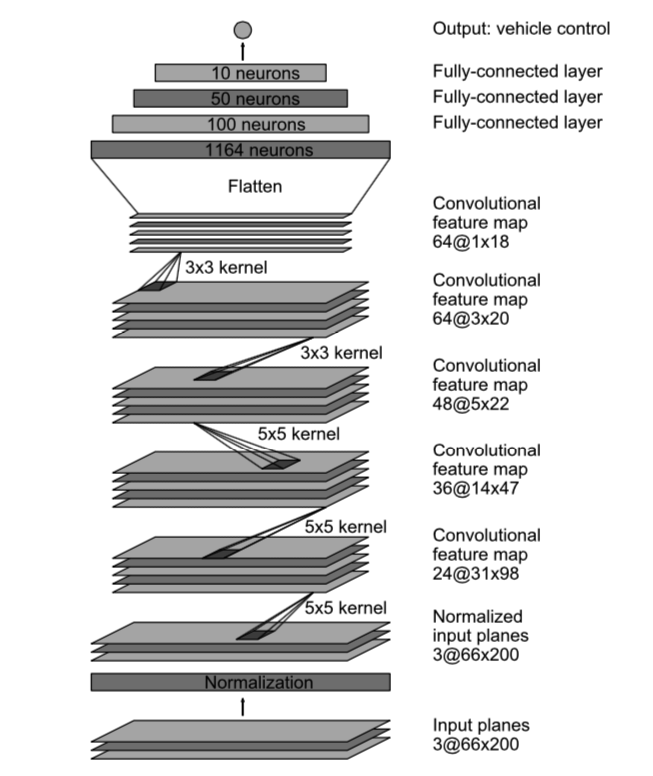

# **Behavioral Cloning Project** 

---

**Behavioral Cloning Project**

The goals / steps of this project are the following:
* Use the simulator to collect data of good driving behavior
* Build, a convolution neural network in Keras that predicts steering angles from images
* Train and validate the model with a training and validation set
* Test that the model successfully drives around track one without leaving the road
* Summarize the results with a written report

[//]: # (Video References)

[Video]: ./run1.mp4 "Video"

## Rubric Points
### Here I will consider the [rubric points](https://review.udacity.com/#!/rubrics/432/view) individually and describe how I addressed each point in my implementation.  

---

### Model Architecture and Training Strategy

#### 1. Final Model Architecture

I decided to use the nVidia model architecture, which was proven to give quite good results and consists of 5 convolutional layers, followed by 3 fully connected layers. The model implementation `nVidiaModel()` can be found in lines #109 through #124 in `model.py`.

Source: https://devblogs.nvidia.com/parallelforall/deep-learning-self-driving-cars/  

I added a pre-processing layer to this model for normalization of the input data. Additionally, I cropped the input images to remove for the driving purpose unnecessary information from the images. I removed the upper 50 % of the image (trees, sky, landscape, far-distance parts of the road) and the lower 20% of the image (parts of the car). This is implemented with `createPreProcessingLayers()` in lines #100 through #107 in `model.py`. 

#### 2. Creation of the Training Set & Training Process

To capture good driving behavior, I made two recording driving track 1 in forward direction. To generalize better, I made an additional recording driving track 1 backwards. For smoother driving behaviour I used the mouse pointer for steering.  

From the beginning, I used data from all three cameras and corrected the steering measurements from the left and right camera images, which is implemente with `correctMeasurements()` in lines #50 through #64 in `model.py`. The first try of the model with a correction factor of 0.1 was not successfull. In the end, 0.2 appeared to be a reasonable value.

The second try with 0.2 already gave quite good performance. However, the sharp left turn after the bridge was missed. I made a short recording only with that particular left turn and added that to the training data, which improved the performance and lead to a successful run of the whole track.  

Moreover, shuffling and flipping the images appeared for my implementation to be sufficient for data augmentation. 3 epoches were enough for sufficient performance on track 1.

The complete video can be found here: ![run1.mp4][Video]
